<h1 align="center">👋 Hi there, I'm Junyi</h1>

  </img>

> Not the framework's advance, but the idea's dance. —— Junyi

- 😄 Pronounciation: [ˈdʒun iː] (somewhat like June·E)
- **You can call me Robert**
- Welcome to my blog: https://www.junyi.dev/

<h2 align="left">⚙️ &nbsp;GitHub Analytics</h2>

<a href="https://github.com/Junyi-99">

  <!--  -->
  <!--  -->
</a>

<!--  -->

## Selected Repos

- [awesomeJunyi](https://github.com/Junyi-99/awesome-junyi)

<h2 align="left"> 🤝🏻 &nbsp;Connect with Me</h2>

	

<!--
Here are some ideas to get you started:

- 🔭 I’m currently working on ...
- 🌱 I’m currently learning ...
- 👯 I’m looking to collaborate on ...
- 🤔 I’m looking for help with ...
- 💬 Ask me about ...
- 📫 How to reach me: ...
- 😄 Pronouns: ...
- ⚡ Fun fact: ...
-->
